# Architecture diagrams

Last updated: 2026-09-05, after BM-6.

The diagrams are Mermaid, so GitHub renders them in the browser and a change to
one shows up as a readable diff. Each carries a short note on what it is meant
to answer; where a shape is unusual, the note says why the code is that way
rather than leaving the reader to guess.

The reasoning behind the decisions these diagrams draw lives in
[IMPLEMENTATION_STATUS.md](IMPLEMENTATION_STATUS.md).

## Contents

1. [Containers and their traffic](#1-containers-and-their-traffic)
2. [Backend layers and packages](#2-backend-layers-and-packages)
3. [Domain model](#3-domain-model)
4. [Access control](#4-access-control)
5. [One vertical slice, class by class](#5-one-vertical-slice-class-by-class)
6. [Frontend structure](#6-frontend-structure)
7. [Entity relationship diagram](#7-entity-relationship-diagram)
8. [Signing in](#8-signing-in)
9. [Registering as an owner](#9-registering-as-an-owner)
10. [An authorized request, end to end](#10-an-authorized-request-end-to-end)
11. [Creating an assistant](#11-creating-an-assistant)
12. [Issuing a rent invoice](#12-issuing-a-rent-invoice)
13. [Downloading an invoice as PDF](#13-downloading-an-invoice-as-pdf)
14. [Profit and loss](#14-profit-and-loss)
15. [Invoice status](#15-invoice-status)
16. [Which screens exist](#16-which-screens-exist)
17. [Which language answers](#17-which-language-answers)
18. [How a failure becomes a status code](#18-how-a-failure-becomes-a-status-code)

---

## 1. Containers and their traffic

Four containers from one `docker-compose.yml`. The arrows worth noticing are
the two that leave the browser: it talks to Keycloak directly for the sign in
redirect and the token, so no password is ever typed into a screen this
application serves. The one exception is registration in section 9, where the
chosen password passes through the backend on its way to Keycloak and is never
stored on our side.

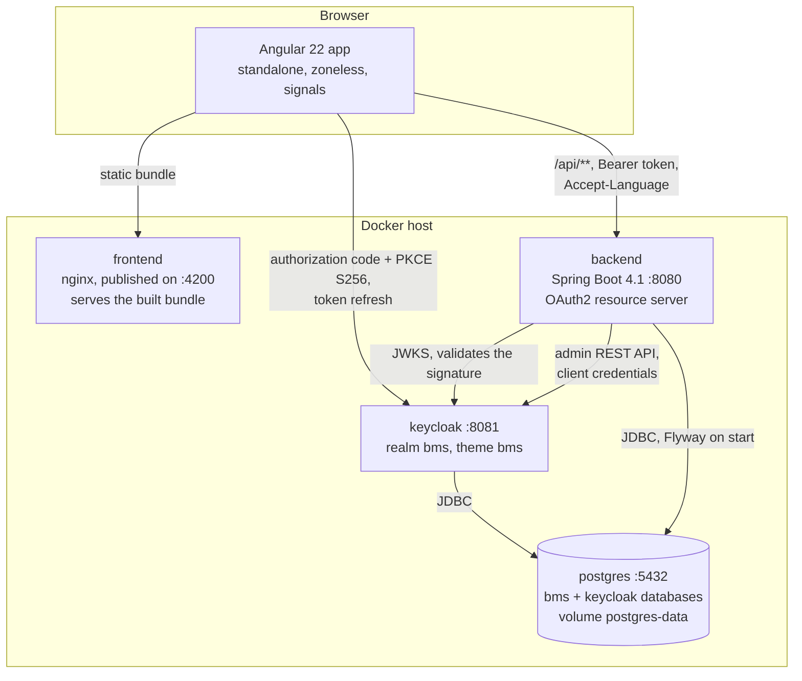
```mermaid
flowchart TB
    subgraph browser["Browser"]
        spa["Angular 22 app<br/>standalone, zoneless, signals"]
    end

    subgraph host["Docker host"]
        fe["frontend<br/>nginx, published on :4200<br/>serves the built bundle"]
        be["backend<br/>Spring Boot 4.1 :8080<br/>OAuth2 resource server"]
        kc["keycloak :8081<br/>realm bms, theme bms"]
        db[("postgres :5432<br/>bms + keycloak databases<br/>volume postgres-data")]
    end

    spa -->|"static bundle"| fe
    spa -->|"authorization code + PKCE S256,<br/>token refresh"| kc
    spa -->|"/api/**, Bearer token,<br/>Accept-Language"| be
    be -->|"JWKS, validates the signature"| kc
    be -->|"admin REST API,<br/>client credentials"| kc
    be -->|"JDBC, Flyway on start"| db
    kc -->|"JDBC"| db
```

Two details here have caused real problems and are pinned deliberately:

- **The issuer is the browser's URL, the JWKS is the internal one.** A token
  minted for `http://localhost:8081/realms/bms` must validate against that same
  issuer string, but the backend fetches keys over the container network at
  `http://keycloak:8080`. `docker-compose.yml` sets the two separately.
- **Keycloak imports a realm only when it does not already have one.** Editing
  `docker/keycloak/realm-bms.json` changes nothing on a stack that has already
  started; `node scripts/sync-realm.mjs` applies it to a running instance.

## 2. Backend layers and packages

The backend is packaged by feature, not by layer: `com.bms.invoice` holds the
controller, the service, the repository, the entity and its DTOs. Every feature
has the same shape, and the ones that hold an owner's records reach sideways to
the same two shared things, `AccessControl` for scoping and `Messages` for
wording.

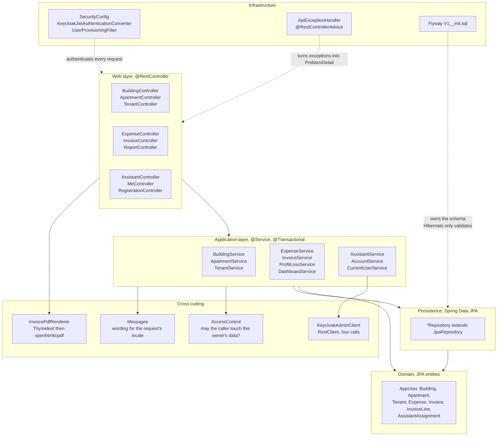
```mermaid
flowchart TB
    subgraph web["Web layer, @RestController"]
        c1["BuildingController<br/>ApartmentController<br/>TenantController"]
        c2["ExpenseController<br/>InvoiceController<br/>ReportController"]
        c3["AssistantController<br/>MeController<br/>RegistrationController"]
    end

    subgraph app["Application layer, @Service, @Transactional"]
        s1["BuildingService<br/>ApartmentService<br/>TenantService"]
        s2["ExpenseService<br/>InvoiceService<br/>ProfitLossService<br/>DashboardService"]
        s3["AssistantService<br/>AccountService<br/>CurrentUserService"]
    end

    subgraph domain["Domain, JPA entities"]
        d1["AppUser, Building, Apartment,<br/>Tenant, Expense, Invoice, InvoiceLine,<br/>AssistantAssignment"]
    end

    subgraph data["Persistence, Spring Data JPA"]
        r1["*Repository extends JpaRepository"]
    end

    subgraph cross["Cross cutting"]
        ac["AccessControl<br/>may the caller touch this owner's data?"]
        msg["Messages<br/>wording for the request's locale"]
        pdf["InvoicePdfRenderer<br/>Thymeleaf then openhtmltopdf"]
        kcc["KeycloakAdminClient<br/>RestClient, four calls"]
    end

    subgraph infra["Infrastructure"]
        sec["SecurityConfig<br/>KeycloakJwtAuthenticationConverter<br/>UserProvisioningFilter"]
        exh["ApiExceptionHandler<br/>@RestControllerAdvice"]
        fly["Flyway V1__init.sql"]
    end

    web --> app
    app --> domain
    app --> data
    data --> domain
    app --> ac
    app --> msg
    web --> pdf
    s3 --> kcc
    sec -.->|"authenticates every request"| web
    exh -.->|"turns exceptions into ProblemDetail"| web
    fly -.->|"owns the schema<br/>Hibernate only validates"| data
```

`Flyway` owning the schema while Hibernate is set to `validate` is what makes
the integration tests meaningful: a mapping that drifts from `V1__init.sql`
fails at startup rather than quietly reshaping a table.

## 3. Domain model

Ownership is the spine. Everything hangs off an `AppUser` through a `Building`,
which is what makes the one scoping question in section 4 sufficient for the
whole application.

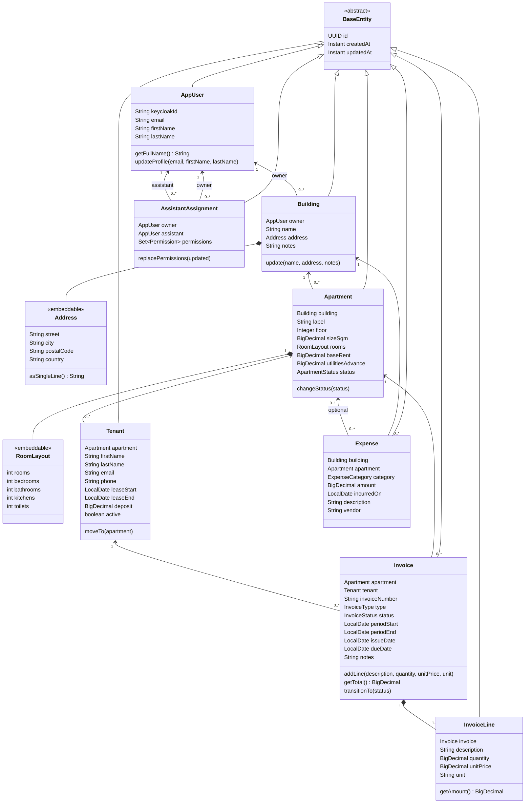
```mermaid
classDiagram
    class BaseEntity {
        <<abstract>>
        UUID id
        Instant createdAt
        Instant updatedAt
    }

    class AppUser {
        String keycloakId
        String email
        String firstName
        String lastName
        getFullName() String
        updateProfile(email, firstName, lastName)
    }

    class Building {
        AppUser owner
        String name
        Address address
        String notes
        update(name, address, notes)
    }

    class Address {
        <<embeddable>>
        String street
        String city
        String postalCode
        String country
        asSingleLine() String
    }

    class Apartment {
        Building building
        String label
        Integer floor
        BigDecimal sizeSqm
        RoomLayout rooms
        BigDecimal baseRent
        BigDecimal utilitiesAdvance
        ApartmentStatus status
        changeStatus(status)
    }

    class RoomLayout {
        <<embeddable>>
        int rooms
        int bedrooms
        int bathrooms
        int kitchens
        int toilets
    }

    class Tenant {
        Apartment apartment
        String firstName
        String lastName
        String email
        String phone
        LocalDate leaseStart
        LocalDate leaseEnd
        BigDecimal deposit
        boolean active
        moveTo(apartment)
    }

    class Expense {
        Building building
        Apartment apartment
        ExpenseCategory category
        BigDecimal amount
        LocalDate incurredOn
        String description
        String vendor
    }

    class Invoice {
        Apartment apartment
        Tenant tenant
        String invoiceNumber
        InvoiceType type
        InvoiceStatus status
        LocalDate periodStart
        LocalDate periodEnd
        LocalDate issueDate
        LocalDate dueDate
        String notes
        addLine(description, quantity, unitPrice, unit)
        getTotal() BigDecimal
        transitionTo(status)
    }

    class InvoiceLine {
        Invoice invoice
        String description
        BigDecimal quantity
        BigDecimal unitPrice
        String unit
        getAmount() BigDecimal
    }

    class AssistantAssignment {
        AppUser owner
        AppUser assistant
        Set~Permission~ permissions
        replacePermissions(updated)
    }

    BaseEntity <|-- AppUser
    BaseEntity <|-- Building
    BaseEntity <|-- Apartment
    BaseEntity <|-- Tenant
    BaseEntity <|-- Expense
    BaseEntity <|-- Invoice
    BaseEntity <|-- InvoiceLine
    BaseEntity <|-- AssistantAssignment

    AppUser "1" <-- "0..*" Building : owner
    Building *-- Address
    Building "1" <-- "0..*" Apartment
    Apartment *-- RoomLayout
    Apartment "1" <-- "0..*" Tenant
    Building "1" <-- "0..*" Expense
    Apartment "0..1" <-- "0..*" Expense : optional
    Apartment "1" <-- "0..*" Invoice
    Tenant "1" <-- "0..*" Invoice
    Invoice "1" *-- "1..*" InvoiceLine
    AppUser "1" <-- "0..*" AssistantAssignment : owner
    AppUser "1" <-- "0..*" AssistantAssignment : assistant
```

Three things the shapes are saying:

- **`InvoiceLine` is a composition**, cascaded and orphan removed, and it stores
  the description as text. A generated line such as "Rent 1A" is written in the
  language of whoever created the invoice and never translated again, exactly
  like a line a user typed.
- **`getAmount()` rounds per line**, half up to two places, and `getTotal()`
  sums the rounded amounts. The reports aggregate the same way, so a total never
  disagrees with the printed invoice by a cent.
- **`Address` and `RoomLayout` are embeddables**, so their columns live on the
  owning table and there is no join for something that has no life of its own.

## 4. Access control

Every read and every write in the application passes through `AccessControl`,
which answers one question: which owners' data may the caller touch under this
permission? Owners hold everything on their own data implicitly; an assistant
holds only what an `AssistantAssignment` grants.

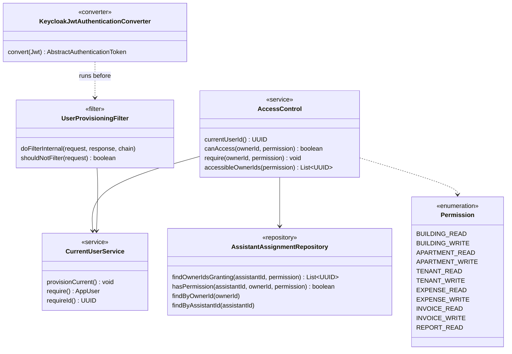
```mermaid
classDiagram
    class AccessControl {
        <<service>>
        currentUserId() UUID
        canAccess(ownerId, permission) boolean
        require(ownerId, permission) void
        accessibleOwnerIds(permission) List~UUID~
    }

    class CurrentUserService {
        <<service>>
        provisionCurrent() void
        require() AppUser
        requireId() UUID
    }

    class AssistantAssignmentRepository {
        <<repository>>
        findOwnerIdsGranting(assistantId, permission) List~UUID~
        hasPermission(assistantId, ownerId, permission) boolean
        findByOwnerId(ownerId)
        findByAssistantId(assistantId)
    }

    class Permission {
        <<enumeration>>
        BUILDING_READ
        BUILDING_WRITE
        APARTMENT_READ
        APARTMENT_WRITE
        TENANT_READ
        TENANT_WRITE
        EXPENSE_READ
        EXPENSE_WRITE
        INVOICE_READ
        INVOICE_WRITE
        REPORT_READ
    }

    class UserProvisioningFilter {
        <<filter>>
        doFilterInternal(request, response, chain)
        shouldNotFilter(request) boolean
    }

    class KeycloakJwtAuthenticationConverter {
        <<converter>>
        convert(Jwt) AbstractAuthenticationToken
    }

    AccessControl --> AssistantAssignmentRepository
    AccessControl --> CurrentUserService
    AccessControl ..> Permission
    UserProvisioningFilter --> CurrentUserService
    KeycloakJwtAuthenticationConverter ..> UserProvisioningFilter : runs before
```

`accessibleOwnerIds` returns the caller's own id plus every owner who granted
them that permission, and services pass the list straight into a repository
query (`findByOwnerIdIn`, `findByApartmentBuildingOwnerIdIn`). Scoping is
therefore part of the query rather than a filter applied to rows already
loaded, so there is no path that reads a row it then has to discard.

`UserProvisioningFilter` creates the local `AppUser` before any request scoped
transaction opens. Doing it lazily inside a service silently did nothing
whenever the caller's outermost transaction was read only, because Hibernate
does not flush there.

## 5. One vertical slice, class by class

Invoices, as the feature that touches the most: another service, a generator
backed by a database sequence, a template engine and a PDF library. Every other
feature is the same shape with fewer collaborators.

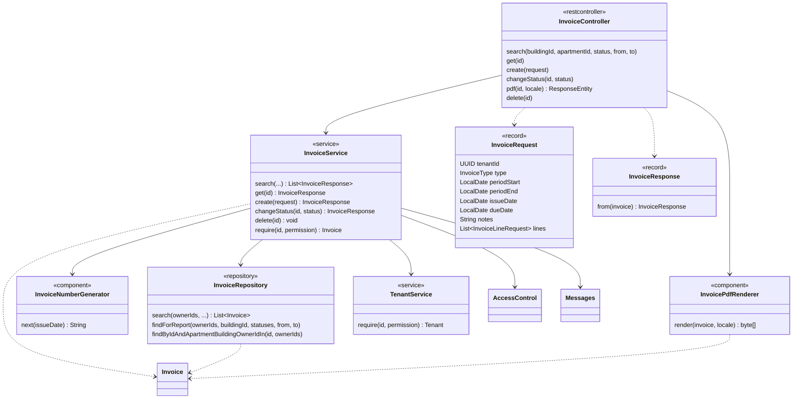
```mermaid
classDiagram
    class InvoiceController {
        <<restcontroller>>
        search(buildingId, apartmentId, status, from, to)
        get(id)
        create(request)
        changeStatus(id, status)
        pdf(id, locale) ResponseEntity
        delete(id)
    }

    class InvoiceService {
        <<service>>
        search(...) List~InvoiceResponse~
        get(id) InvoiceResponse
        create(request) InvoiceResponse
        changeStatus(id, status) InvoiceResponse
        delete(id) void
        require(id, permission) Invoice
    }

    class InvoiceRepository {
        <<repository>>
        search(ownerIds, ...) List~Invoice~
        findForReport(ownerIds, buildingId, statuses, from, to)
        findByIdAndApartmentBuildingOwnerIdIn(id, ownerIds)
    }

    class InvoiceNumberGenerator {
        <<component>>
        next(issueDate) String
    }

    class InvoicePdfRenderer {
        <<component>>
        render(invoice, locale) byte[]
    }

    class TenantService {
        <<service>>
        require(id, permission) Tenant
    }

    class InvoiceRequest {
        <<record>>
        UUID tenantId
        InvoiceType type
        LocalDate periodStart
        LocalDate periodEnd
        LocalDate issueDate
        LocalDate dueDate
        String notes
        List~InvoiceLineRequest~ lines
    }

    class InvoiceResponse {
        <<record>>
        from(invoice) InvoiceResponse
    }

    InvoiceController --> InvoiceService
    InvoiceController --> InvoicePdfRenderer
    InvoiceController ..> InvoiceRequest
    InvoiceController ..> InvoiceResponse
    InvoiceService --> InvoiceRepository
    InvoiceService --> TenantService
    InvoiceService --> InvoiceNumberGenerator
    InvoiceService --> AccessControl
    InvoiceService --> Messages
    InvoiceService ..> Invoice
    InvoiceRepository ..> Invoice
    InvoicePdfRenderer ..> Invoice
```

The DTOs are records and never leave the boundary: a request record is
validated by Jakarta Bean Validation on the way in, a response record is built
by a static `from` on the way out, and no entity is ever serialized to JSON.
That is what keeps a lazy association from being touched after the transaction
has closed.

The controller reaching `InvoicePdfRenderer` directly, rather than through the
service, is deliberate: `pdf` is the one endpoint that needs the entity itself
and its lazy associations, so it carries `@Transactional(readOnly = true)` and
renders inside that transaction.

## 6. Frontend structure

One bundle, standalone components, no NgModules, zoneless with signals. The
core services are the only shared state; every screen is a lazily loaded
component that injects the API classes it needs.

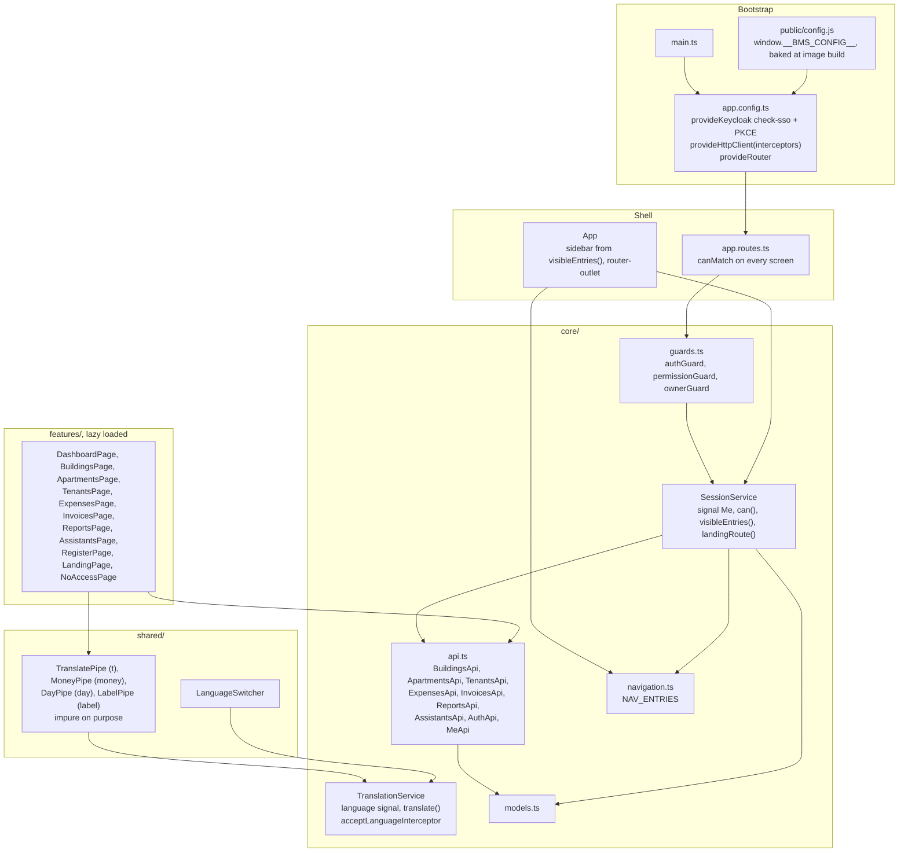
```mermaid
flowchart TB
    subgraph boot["Bootstrap"]
        main["main.ts"]
        cfgw["public/config.js<br/>window.__BMS_CONFIG__, baked at image build"]
        appcfg["app.config.ts<br/>provideKeycloak check-sso + PKCE<br/>provideHttpClient(interceptors)<br/>provideRouter"]
    end

    subgraph shell["Shell"]
        app["App<br/>sidebar from visibleEntries(), router-outlet"]
        routes["app.routes.ts<br/>canMatch on every screen"]
    end

    subgraph core["core/"]
        session["SessionService<br/>signal Me, can(), visibleEntries(), landingRoute()"]
        guards["guards.ts<br/>authGuard, permissionGuard, ownerGuard"]
        api["api.ts<br/>BuildingsApi, ApartmentsApi, TenantsApi,<br/>ExpensesApi, InvoicesApi, ReportsApi,<br/>AssistantsApi, AuthApi, MeApi"]
        i18n["TranslationService<br/>language signal, translate()<br/>acceptLanguageInterceptor"]
        nav["navigation.ts<br/>NAV_ENTRIES"]
        models["models.ts"]
    end

    subgraph features["features/, lazy loaded"]
        pages["DashboardPage, BuildingsPage, ApartmentsPage,<br/>TenantsPage, ExpensesPage, InvoicesPage,<br/>ReportsPage, AssistantsPage,<br/>RegisterPage, LandingPage, NoAccessPage"]
    end

    subgraph sharedui["shared/"]
        pipes["TranslatePipe (t), MoneyPipe (money),<br/>DayPipe (day), LabelPipe (label)<br/>impure on purpose"]
        lang["LanguageSwitcher"]
    end

    main --> appcfg
    cfgw --> appcfg
    appcfg --> routes
    routes --> guards
    guards --> session
    app --> session
    app --> nav
    session --> api
    session --> nav
    pages --> api
    pages --> pipes
    pipes --> i18n
    lang --> i18n
    api --> models
    session --> models
```

The pipes are impure, which normally deserves an argument. A pure pipe caches
on its argument, and the argument here is the message key, which does not
change when the language does; the old wording would stay on screen. An impure
pipe reads the language signal on every run, which both registers the
dependency with the view and recomputes once it is marked dirty.

## 7. Entity relationship diagram

The tables as `V1__init.sql` creates them. Foreign keys carry their delete
behaviour, because it is the part that is invisible in the class diagram and
matters most when something is removed.

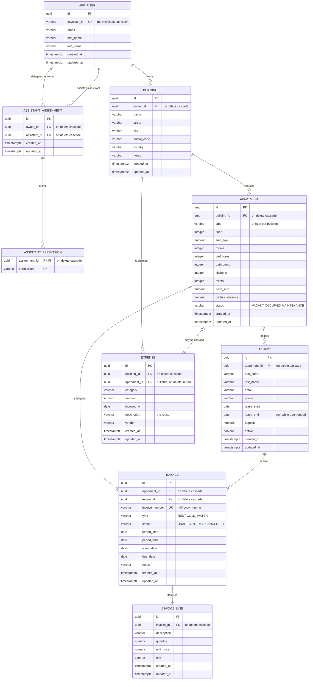
```mermaid
erDiagram
    APP_USER {
        uuid id PK
        varchar keycloak_id UK "the Keycloak sub claim"
        varchar email
        varchar first_name
        varchar last_name
        timestamptz created_at
        timestamptz updated_at
    }

    ASSISTANT_ASSIGNMENT {
        uuid id PK
        uuid owner_id FK "on delete cascade"
        uuid assistant_id FK "on delete cascade"
        timestamptz created_at
        timestamptz updated_at
    }

    ASSISTANT_PERMISSION {
        uuid assignment_id PK,FK "on delete cascade"
        varchar permission PK
    }

    BUILDING {
        uuid id PK
        uuid owner_id FK "on delete cascade"
        varchar name
        varchar street
        varchar city
        varchar postal_code
        varchar country
        varchar notes
        timestamptz created_at
        timestamptz updated_at
    }

    APARTMENT {
        uuid id PK
        uuid building_id FK "on delete cascade"
        varchar label "unique per building"
        integer floor
        numeric size_sqm
        integer rooms
        integer bedrooms
        integer bathrooms
        integer kitchens
        integer toilets
        numeric base_rent
        numeric utilities_advance
        varchar status "VACANT OCCUPIED MAINTENANCE"
        timestamptz created_at
        timestamptz updated_at
    }

    TENANT {
        uuid id PK
        uuid apartment_id FK "on delete cascade"
        varchar first_name
        varchar last_name
        varchar email
        varchar phone
        date lease_start
        date lease_end "null while open ended"
        numeric deposit
        boolean active
        timestamptz created_at
        timestamptz updated_at
    }

    EXPENSE {
        uuid id PK
        uuid building_id FK "on delete cascade"
        uuid apartment_id FK "nullable, on delete set null"
        varchar category
        numeric amount
        date incurred_on
        varchar description "the reason"
        varchar vendor
        timestamptz created_at
        timestamptz updated_at
    }

    INVOICE {
        uuid id PK
        uuid apartment_id FK "on delete cascade"
        uuid tenant_id FK "on delete cascade"
        varchar invoice_number UK "INV-yyyy-nnnnnn"
        varchar type "RENT COLD_WATER"
        varchar status "DRAFT SENT PAID CANCELLED"
        date period_start
        date period_end
        date issue_date
        date due_date
        varchar notes
        timestamptz created_at
        timestamptz updated_at
    }

    INVOICE_LINE {
        uuid id PK
        uuid invoice_id FK "on delete cascade"
        varchar description
        numeric quantity
        numeric unit_price
        varchar unit
        timestamptz created_at
        timestamptz updated_at
    }

    APP_USER ||--o{ BUILDING : owns
    APP_USER ||--o{ ASSISTANT_ASSIGNMENT : "delegates as owner"
    APP_USER ||--o{ ASSISTANT_ASSIGNMENT : "assists as assistant"
    ASSISTANT_ASSIGNMENT ||--o{ ASSISTANT_PERMISSION : grants
    BUILDING ||--o{ APARTMENT : contains
    BUILDING ||--o{ EXPENSE : "is charged"
    APARTMENT ||--o{ TENANT : houses
    APARTMENT |o--o{ EXPENSE : "may be charged"
    APARTMENT ||--o{ INVOICE : "is billed for"
    TENANT ||--o{ INVOICE : "is billed"
    INVOICE ||--|{ INVOICE_LINE : itemises
```

Constraints not visible above, all enforced in the database:

| Constraint | Table | What it prevents |
|---|---|---|
| `uq_assignment_owner_assistant` | `assistant_assignment` | the same assistant assigned twice to one owner |
| `ck_assignment_not_self` | `assistant_assignment` | an owner assisting themselves |
| `uq_apartment_building_label` | `apartment` | two apartments called `1A` in one building |
| `ck_tenant_lease_range` | `tenant` | a lease that ends before it starts |
| `ck_invoice_period`, `ck_invoice_due` | `invoice` | a period or a due date running backwards |
| `invoice_number_seq` | sequence | duplicate invoice numbers under concurrent creation |

An expense keeps its building when the apartment it named is deleted
(`on delete set null`), because the money was still spent and still belongs in
the profit and loss. Everything else cascades from the owner down.

The one relationship in the diagram the schema does not enforce is that an
invoice has at least one line. `InvoiceService.create` guarantees it, by
generating the rent lines itself when none were supplied and refusing any other
type without them, but nothing stops a row being inserted around it.

## 8. Signing in

Authorization code with PKCE, run entirely in the browser by `keycloak-js`.
Nothing here is triggered at bootstrap: the route guard is what starts it.

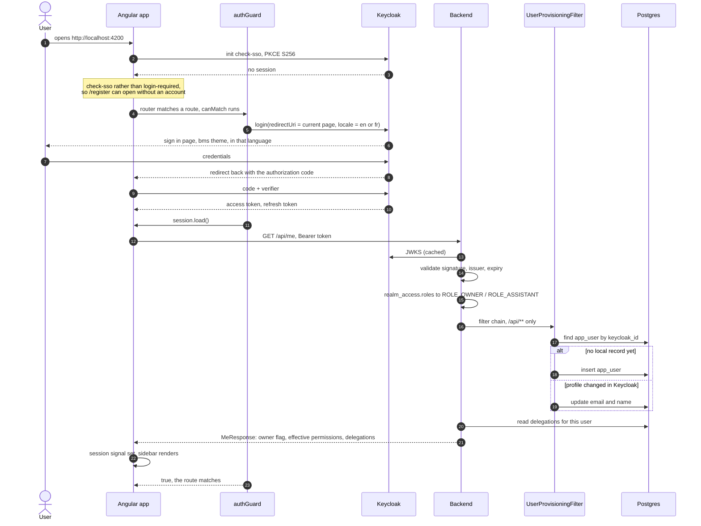
```mermaid
sequenceDiagram
    autonumber
    actor U as User
    participant B as Angular app
    participant G as authGuard
    participant K as Keycloak
    participant A as Backend
    participant F as UserProvisioningFilter
    participant DB as Postgres

    U->>B: opens http://localhost:4200
    B->>K: init check-sso, PKCE S256
    K-->>B: no session
    Note over B: check-sso rather than login-required,<br/>so /register can open without an account
    B->>G: router matches a route, canMatch runs
    G->>K: login(redirectUri = current page, locale = en or fr)
    K-->>U: sign in page, bms theme, in that language
    U->>K: credentials
    K-->>B: redirect back with the authorization code
    B->>K: code + verifier
    K-->>B: access token, refresh token
    G->>B: session.load()
    B->>A: GET /api/me, Bearer token
    A->>K: JWKS (cached)
    A->>A: validate signature, issuer, expiry
    A->>A: realm_access.roles to ROLE_OWNER / ROLE_ASSISTANT
    A->>F: filter chain, /api/** only
    F->>DB: find app_user by keycloak_id
    alt no local record yet
        F->>DB: insert app_user
    else profile changed in Keycloak
        F->>DB: update email and name
    end
    A->>DB: read delegations for this user
    A-->>B: MeResponse: owner flag, effective permissions, delegations
    B->>B: session signal set, sidebar renders
    G-->>B: true, the route matches
```

The profile is loaded by the guards and not by an app initializer. Angular
starts every initializer at once without waiting for the one before, so an
initializer here ran while Keycloak was still deciding whether there was a
session, read `authenticated` as false, and bounced the browser between the app
and the login page for ever. Guards run after bootstrap, when Keycloak has
finished. A failed `/api/me` is not remembered either, so the next guard tries
again rather than stranding the user because the backend was a moment slower to
start than the browser.

## 9. Registering as an owner

The one endpoint reachable without a token. It has to assign the `owner` realm
role, which only the backend can do, which is why Keycloak's own registration
stays switched off and the themed sign in page links here instead.

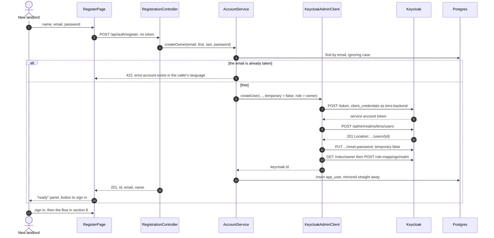
```mermaid
sequenceDiagram
    autonumber
    actor U as New landlord
    participant B as RegisterPage
    participant A as RegistrationController
    participant S as AccountService
    participant KC as KeycloakAdminClient
    participant K as Keycloak
    participant DB as Postgres

    U->>B: name, email, password
    B->>A: POST /api/auth/register, no token
    A->>S: createOwner(email, first, last, password)
    S->>DB: find by email, ignoring case
    alt the email is already taken
        S-->>B: 422, error.account.exists in the caller's language
    else free
        S->>KC: createUser(..., temporary = false, role = owner)
        KC->>K: POST /token, client_credentials as bms-backend
        K-->>KC: service account token
        KC->>K: POST /admin/realms/bms/users
        K-->>KC: 201 Location: .../users/{id}
        KC->>K: PUT .../reset-password, temporary false
        KC->>K: GET /roles/owner then POST role-mappings/realm
        KC-->>S: keycloak id
        S->>DB: insert app_user, mirrored straight away
        A-->>B: 201, id, email, name
        B-->>U: "ready" panel, button to sign in
    end
    U->>B: sign in, then the flow in section 8
```

The local record is written here rather than left to the provisioning filter,
so an owner can create an assistant and grant them work before that assistant
has ever signed in.

Every failure of the Keycloak admin API becomes a 502 through
`IdentityProviderException`. The admin client's own HTTP errors used to escape
untouched, so a realm missing the `bms-backend` client answered registration
with a bare 401 and an empty body, which reads as "you are not signed in" on an
endpoint that needs no sign in.

## 10. An authorized request, end to end

Listing buildings, which is the shape of every read in the application. The
point of the diagram is where the owner scoping happens: inside the query.

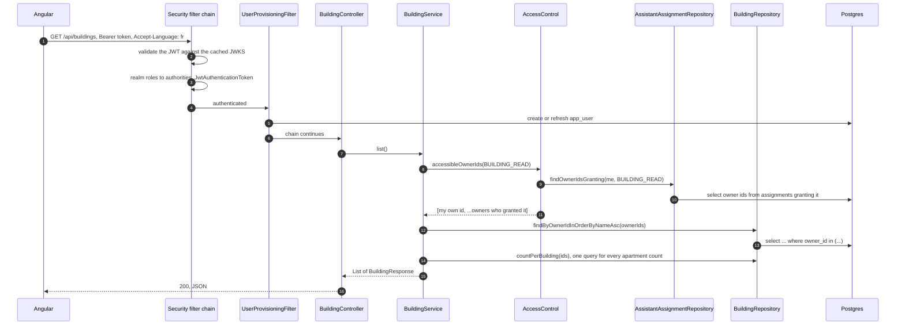
```mermaid
sequenceDiagram
    autonumber
    participant B as Angular
    participant SEC as Security filter chain
    participant F as UserProvisioningFilter
    participant C as BuildingController
    participant S as BuildingService
    participant AC as AccessControl
    participant AR as AssistantAssignmentRepository
    participant R as BuildingRepository
    participant DB as Postgres

    B->>SEC: GET /api/buildings, Bearer token, Accept-Language: fr
    SEC->>SEC: validate the JWT against the cached JWKS
    SEC->>SEC: realm roles to authorities, JwtAuthenticationToken
    SEC->>F: authenticated
    F->>DB: create or refresh app_user
    F->>C: chain continues
    C->>S: list()
    S->>AC: accessibleOwnerIds(BUILDING_READ)
    AC->>AR: findOwnerIdsGranting(me, BUILDING_READ)
    AR->>DB: select owner ids from assignments granting it
    AC-->>S: [my own id, ...owners who granted it]
    S->>R: findByOwnerIdInOrderByNameAsc(ownerIds)
    R->>DB: select ... where owner_id in (...)
    S->>R: countPerBuilding(ids), one query for every apartment count
    S-->>C: List of BuildingResponse
    C-->>B: 200, JSON
```

An assistant with no `BUILDING_READ` grant gets an empty list, not a 403,
because the query simply matches nothing. A 403 is raised only where a specific
resource was named: `AccessControl.require` and the `require(id, permission)`
methods on the services, which throw `NotFoundException` for a resource outside
the caller's scope so that a probe cannot tell "not yours" from "does not
exist".

The apartment counts are one grouped query rather than one per building. It is
the only place a list endpoint could have gone quadratic.

## 11. Creating an assistant

An owner adds an assistant by email. If that email is already someone's
account, they are simply granted access; if it is not, an account is created
and a temporary password comes back once and never again.

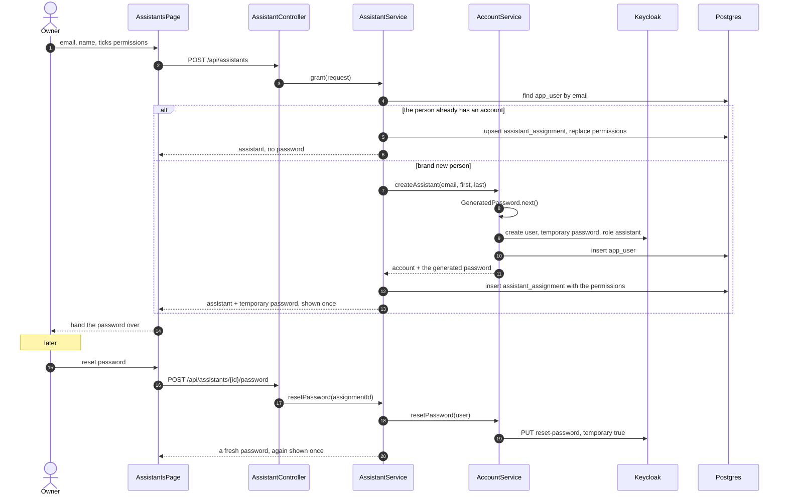
```mermaid
sequenceDiagram
    autonumber
    actor O as Owner
    participant B as AssistantsPage
    participant C as AssistantController
    participant S as AssistantService
    participant AS as AccountService
    participant K as Keycloak
    participant DB as Postgres

    O->>B: email, name, ticks permissions
    B->>C: POST /api/assistants
    C->>S: grant(request)
    S->>DB: find app_user by email
    alt the person already has an account
        S->>DB: upsert assistant_assignment, replace permissions
        S-->>B: assistant, no password
    else brand new person
        S->>AS: createAssistant(email, first, last)
        AS->>AS: GeneratedPassword.next()
        AS->>K: create user, temporary password, role assistant
        AS->>DB: insert app_user
        AS-->>S: account + the generated password
        S->>DB: insert assistant_assignment with the permissions
        S-->>B: assistant + temporary password, shown once
    end
    B-->>O: hand the password over

    Note over O: later
    O->>B: reset password
    B->>C: POST /api/assistants/{id}/password
    C->>S: resetPassword(assignmentId)
    S->>AS: resetPassword(user)
    AS->>K: PUT reset-password, temporary true
    S-->>B: a fresh password, again shown once
```

Keycloak marks the password temporary, so the assistant's first sign in carries
an `UPDATE_PASSWORD` required action and they choose their own. The password is
never stored on our side, which is why the response can only ever show it at
the moment it was generated.

Assistants cannot delegate further: `AssistantService` reads the owner from the
current user and refuses an assignment whose subject is the caller
(`error.assistant.self`), and `require` treats an assignment belonging to
another owner as not found.

## 12. Issuing a rent invoice

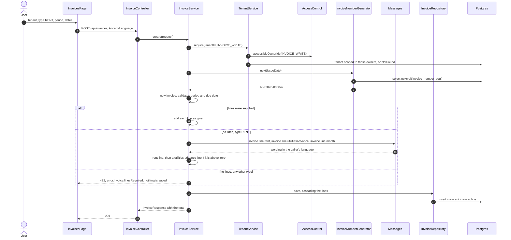
```mermaid
sequenceDiagram
    autonumber
    actor U as User
    participant B as InvoicesPage
    participant C as InvoiceController
    participant S as InvoiceService
    participant TS as TenantService
    participant AC as AccessControl
    participant G as InvoiceNumberGenerator
    participant M as Messages
    participant R as InvoiceRepository
    participant DB as Postgres

    U->>B: tenant, type RENT, period, dates
    B->>C: POST /api/invoices, Accept-Language
    C->>S: create(request)
    S->>TS: require(tenantId, INVOICE_WRITE)
    TS->>AC: accessibleOwnerIds(INVOICE_WRITE)
    TS->>DB: tenant scoped to those owners, or NotFound
    S->>G: next(issueDate)
    G->>DB: select nextval('invoice_number_seq')
    G-->>S: INV-2026-000042
    S->>S: new Invoice, validates period and due date
    alt lines were supplied
        S->>S: add each line as given
    else no lines, type RENT
        S->>M: invoice.line.rent, invoice.line.utilitiesAdvance, invoice.line.month
        M-->>S: wording in the caller's language
        S->>S: rent line, then a utilities advance line if it is above zero
    else no lines, any other type
        S-->>B: 422, error.invoice.linesRequired, nothing is saved
    end
    S->>R: save, cascading the lines
    R->>DB: insert invoice + invoice_line
    S-->>C: InvoiceResponse with the total
    C-->>B: 201
```

Invoice numbers come from a Postgres sequence rather than a count, so two
invoices created at the same moment cannot collide. The generated lines are
translated once, at this moment, and stored as text: making them follow the
reader would mean storing a code instead, and no line a user types could work
that way.

## 13. Downloading an invoice as PDF

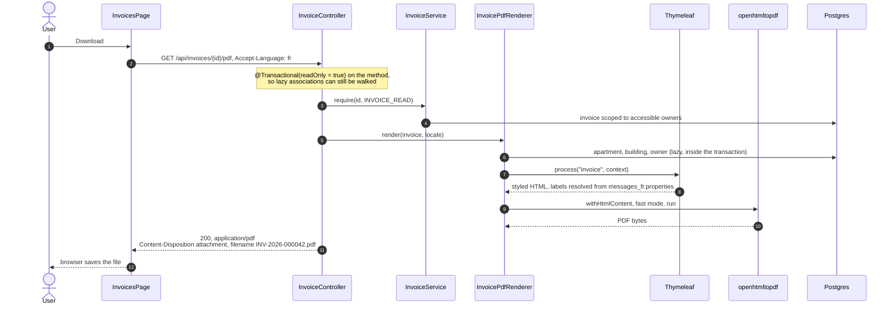
```mermaid
sequenceDiagram
    autonumber
    actor U as User
    participant B as InvoicesPage
    participant C as InvoiceController
    participant S as InvoiceService
    participant P as InvoicePdfRenderer
    participant T as Thymeleaf
    participant O as openhtmltopdf
    participant DB as Postgres

    U->>B: Download
    B->>C: GET /api/invoices/{id}/pdf, Accept-Language: fr
    Note over C: @Transactional(readOnly = true) on the method,<br/>so lazy associations can still be walked
    C->>S: require(id, INVOICE_READ)
    S->>DB: invoice scoped to accessible owners
    C->>P: render(invoice, locale)
    P->>DB: apartment, building, owner (lazy, inside the transaction)
    P->>T: process("invoice", context)
    T-->>P: styled HTML, labels resolved from messages_fr.properties
    P->>O: withHtmlContent, fast mode, run
    O-->>P: PDF bytes
    C-->>B: 200, application/pdf<br/>Content-Disposition attachment, filename INV-2026-000042.pdf
    B-->>U: browser saves the file
```

The wording around the lines follows the download request; the line
descriptions keep the language they were written in. `Content-Disposition` is
in the CORS exposed headers, otherwise the browser would hide the filename from
the app.

## 14. Profit and loss

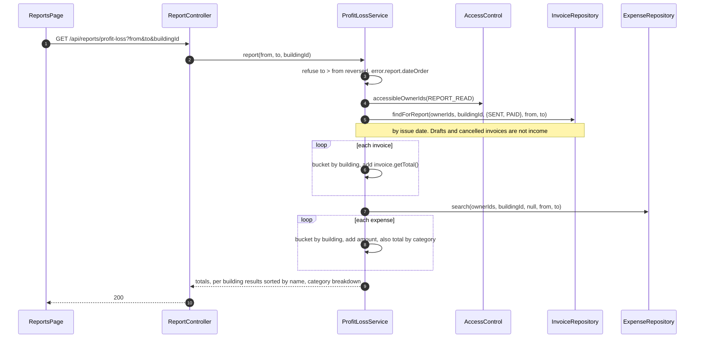
```mermaid
sequenceDiagram
    autonumber
    participant B as ReportsPage
    participant C as ReportController
    participant P as ProfitLossService
    participant AC as AccessControl
    participant IR as InvoiceRepository
    participant ER as ExpenseRepository

    B->>C: GET /api/reports/profit-loss?from&to&buildingId
    C->>P: report(from, to, buildingId)
    P->>P: refuse to > from reversed, error.report.dateOrder
    P->>AC: accessibleOwnerIds(REPORT_READ)
    P->>IR: findForReport(ownerIds, buildingId, {SENT, PAID}, from, to)
    Note over P,IR: by issue date. Drafts and cancelled invoices are not income
    loop each invoice
        P->>P: bucket by building, add invoice.getTotal()
    end
    P->>ER: search(ownerIds, buildingId, null, from, to)
    loop each expense
        P->>P: bucket by building, add amount, also total by category
    end
    P-->>C: totals, per building results sorted by name, category breakdown
    C-->>B: 200
```

The totals are aggregated in memory rather than summed in SQL, so that they add
up the rounded per line amounts the invoice itself prints. A `sum()` over
`quantity * unit_price` in the database would round once at the end and could
differ by a cent from the documents the tenant received.

`DashboardService` reuses this service for the year to date position, calling
`report(1 January, today, null)` alongside its own portfolio counts and rent
roll, so the dashboard and the report can never disagree.

## 15. Invoice status

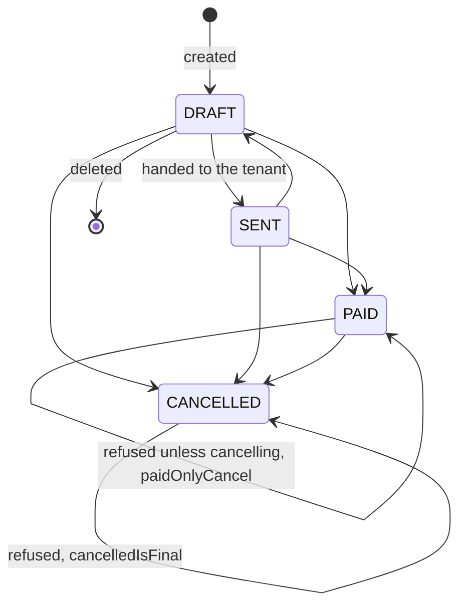
```mermaid
stateDiagram-v2
    [*] --> DRAFT : created
    DRAFT --> SENT : handed to the tenant
    DRAFT --> PAID
    DRAFT --> CANCELLED
    DRAFT --> [*] : deleted
    SENT --> PAID
    SENT --> CANCELLED
    SENT --> DRAFT
    PAID --> CANCELLED
    CANCELLED --> CANCELLED : refused, cancelledIsFinal
    PAID --> PAID : refused unless cancelling, paidOnlyCancel
```

Two rules, both in `Invoice.transitionTo`: cancelled is final, and a paid
invoice may only be cancelled. Deletion is narrower still and lives in
`InvoiceService.delete`: only a `DRAFT` may be deleted, because a document a
tenant has already received has to stay on the record.

Apartments have a simpler cycle with no rules attached, `VACANT`, `OCCUPIED`
and `MAINTENANCE`, set directly by the user.

## 16. Which screens exist

The sidebar and the router read the same list, `NAV_ENTRIES`, so a screen can
never be advertised in the navigation while its route refuses to load.

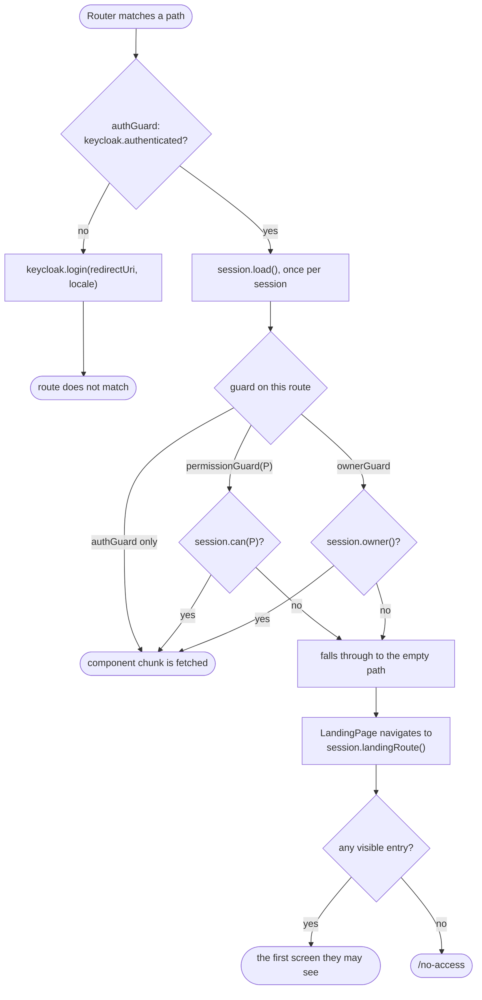
```mermaid
flowchart TB
    start(["Router matches a path"]) --> auth{"authGuard:<br/>keycloak.authenticated?"}
    auth -->|no| login["keycloak.login(redirectUri, locale)"]
    login --> stop1(["route does not match"])
    auth -->|yes| load["session.load(), once per session"]
    load --> kind{"guard on this route"}
    kind -->|"permissionGuard(P)"| perm{"session.can(P)?"}
    kind -->|"ownerGuard"| own{"session.owner()?"}
    kind -->|"authGuard only"| ok(["component chunk is fetched"])
    perm -->|yes| ok
    own -->|yes| ok
    perm -->|no| fall["falls through to the empty path"]
    own -->|no| fall
    fall --> landing["LandingPage navigates to<br/>session.landingRoute()"]
    landing --> first{"any visible entry?"}
    first -->|yes| firstpage(["the first screen they may see"])
    first -->|no| noaccess(["/no-access"])
```

The guards are `canMatch`, not `canActivate`, because only `canMatch` stops the
router from matching the route at all, which is what keeps the lazy chunk from
being downloaded: an assistant gets no hint that the screen exists. A
redirecting route cannot carry a guard, which is why the empty path is a small
component that navigates on rather than a `redirectTo`.

The backend does not trust any of this. Every request is scoped again by
`AccessControl`; the guards decide what to render, not what is allowed.

## 17. Which language answers

One choice in the browser drives four different places.

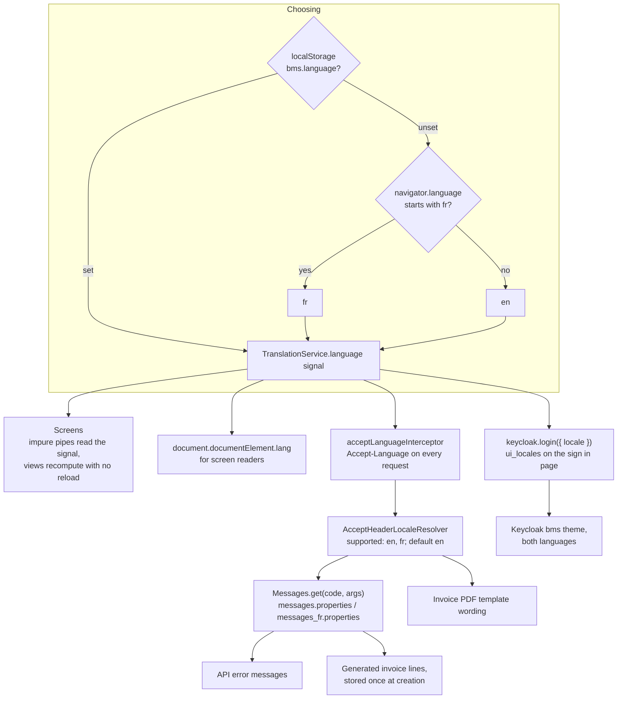
```mermaid
flowchart TB
    subgraph choose["Choosing"]
        stored{"localStorage<br/>bms.language?"}
        stored -->|set| use["TranslationService.language signal"]
        stored -->|unset| navlang{"navigator.language<br/>starts with fr?"}
        navlang -->|yes| fr["fr"] --> use
        navlang -->|no| en["en"] --> use
    end

    use --> ui["Screens<br/>impure pipes read the signal,<br/>views recompute with no reload"]
    use --> htmllang["document.documentElement.lang<br/>for screen readers"]
    use --> hdr["acceptLanguageInterceptor<br/>Accept-Language on every request"]
    use --> uilocales["keycloak.login({ locale })<br/>ui_locales on the sign in page"]

    hdr --> resolver["AcceptHeaderLocaleResolver<br/>supported: en, fr; default en"]
    resolver --> msgs["Messages.get(code, args)<br/>messages.properties / messages_fr.properties"]
    msgs --> errs["API error messages"]
    msgs --> lines["Generated invoice lines,<br/>stored once at creation"]
    resolver --> pdfwords["Invoice PDF template wording"]
    uilocales --> theme["Keycloak bms theme,<br/>both languages"]
```

The resolver's list of supported locales is closed on purpose, so a header
asking for something else falls back to English rather than to whatever locale
the container happens to run under.

The English dictionary is the source of truth for the keys: `MessageKey` is
derived from it and French is typed as `Record<MessageKey, string>`, so a key
missing from French fails the build rather than leaving a blank on screen.

## 18. How a failure becomes a status code

Exceptions carry a message code and its arguments, never a finished sentence.
`ApiExceptionHandler` resolves them against the request's locale and answers
with an RFC 9457 `ProblemDetail`.

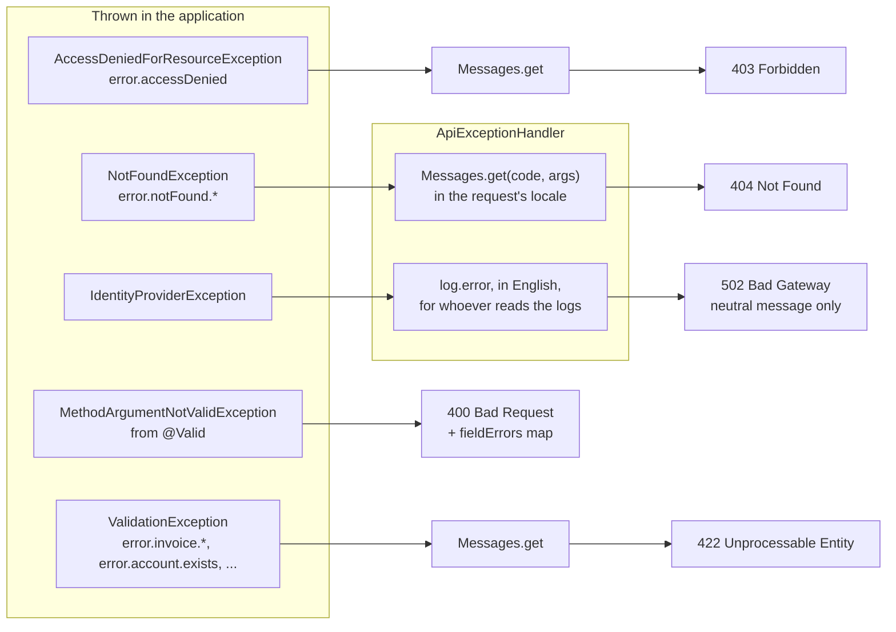
```mermaid
flowchart LR
    subgraph thrown["Thrown in the application"]
        nf["NotFoundException<br/>error.notFound.*"]
        ad["AccessDeniedForResourceException<br/>error.accessDenied"]
        val["ValidationException<br/>error.invoice.*, error.account.exists, ..."]
        idp["IdentityProviderException"]
        bean["MethodArgumentNotValidException<br/>from @Valid"]
    end

    subgraph handler["ApiExceptionHandler"]
        msg["Messages.get(code, args)<br/>in the request's locale"]
        log["log.error, in English,<br/>for whoever reads the logs"]
    end

    nf --> msg --> r404["404 Not Found"]
    ad --> msg2["Messages.get"] --> r403["403 Forbidden"]
    val --> msg3["Messages.get"] --> r422["422 Unprocessable Entity"]
    bean --> r400["400 Bad Request<br/>+ fieldErrors map"]
    idp --> log --> r502["502 Bad Gateway<br/>neutral message only"]
```

A Keycloak failure is a 502 and never a 401. A misconfigured or unreachable
identity provider is our problem, not the caller's, so the reason is logged and
the caller is only told to try again later.

French messages use the typographic apostrophe. Spring runs `MessageFormat`
over any message that takes arguments, and there `'` is an escape character
that silently eats the text around it; `’` is both safe and correct French.
